# OpenClassrooms

## Application **MA REUNION**

Les listes des collaborateurs et des salles sont fixées par avance.

Il y a 20 collaborateurs avec comme informations : le nom, l'adresse mail, le service où ils officient, leur qualification.
 
Il y a 10 Salles dont les informations données sont : le numéro de salle, le nom de la salle, l'étage où elle se trouve et le nombre maximum de personnes qu'elle peut accueillir.

## Tour d'horizon de l'application  

__Pour lancer l'application, cliquer sur son icone__
  
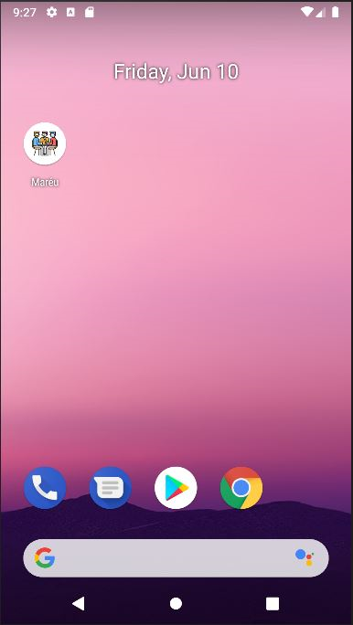 

Au lancement de l'application, les meetings obsolètes seront supprimés avant l'affichage de la liste  

__A l'ouverture de l'application, la liste des meetings déjà créés et non obsolètes s'affichent.__  

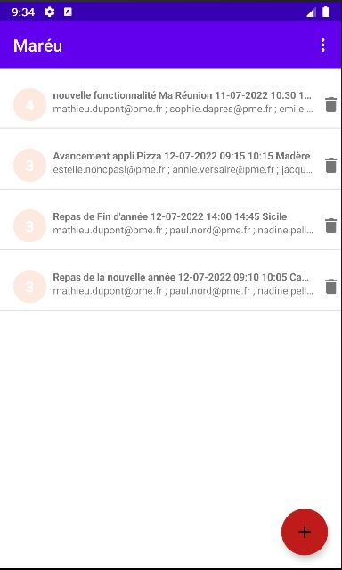 

La première ligne de chaque meeting contient :
* le titre du meeting
* la date
* l'heure de départ
* l'heure de fin
* le nom de la salle

La seconde ligne contient :
* la liste des participants avec leur adresse mail

Le cercle au début indique le nombre de participants à la réunion  

__Vous pouvez filtrer les meetings par date ou par salle__  

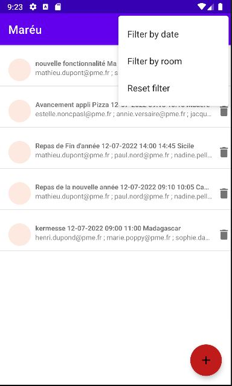  

__Filtré par date__  

.png)   

__Filtré par salle__  

Choisissez la salle et validez avec le bouton set  

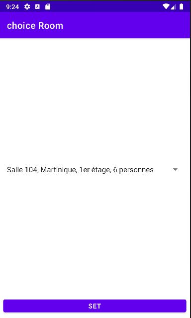  
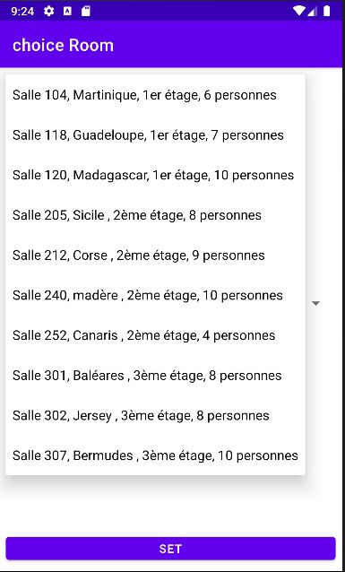  
.png)   

Reset pour revenir à l'écran initial avec tous les meetings d'affichés.  

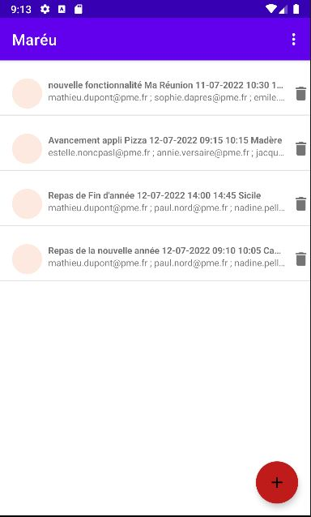    

__Pour supprimer un meeting, cliquez sur la corbeille et répondez oui à la question__  

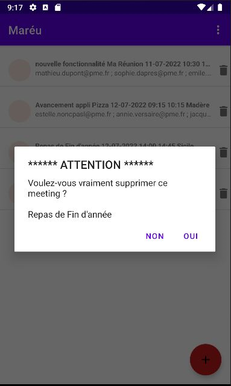  

__Pour consulter ou modifier un meeting, cliquer sur la ligne du meeting__  

L'écran de consultation modification apparait

Chaque zone est modifiable  

* Le titre
* La description détaillée
* la date
* l'heure de départ
* la durée
  * *(l'heure de fin n'est pas accéssible, elle est le résultat de l'heure de départ et de la durée)*
* la liste des participants (vous pouvez en rajouter, en enlever, en changer)
* la salle  

cliquez sur save meeting pour valider les modifications ou sur la flèche retour pour abandonner  

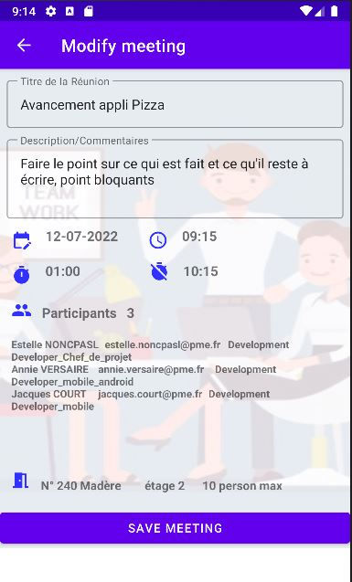  

La validation vous ramène dans l'écran principal   

__Pour créer un meeting, cliquer sur le bouton +__   

    

Vous êtes alors dans l'écran de création  

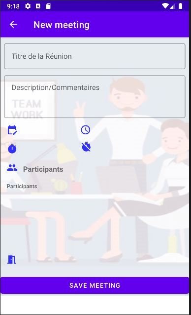  

Saisissez les différentes données  

* Le titre, vous disposez d'une ligne

* La description, 4 lignes

* La date ne peut être inférieure à la date du jour

* La durée ne peut être suppérieure à 4 heures

* la sélection des participants se fait dans un écran spécifique.  

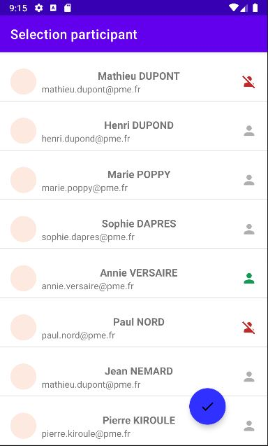  

* Les participants pouvant être sélectionnés sont indiqués avec une icone grise
* Les participants déjà sélectionnés pour ce meetings ont une icone verte
* Les participants avec une icone rouge ne sont pas disponibles, car déjà pris par un autre meeting à la même période (il s'agit d'une indication, non bloquante)
* Si vous saisissez plus de 10 participants, vous aurez un message d'alerte (non bloquant)    
* Pour valider la sélection, cliquez sur le bouton bleu  

La sélection de la salle se fait aussi dans un écran à part  

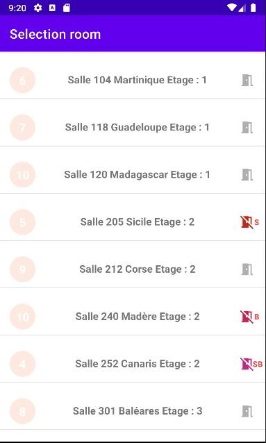  

* Le cercle en début de ligne contient le nombre maximun que la salle peut accepter
* Les salles sélectionnables ont une icone grise
* La salle sélectiionnée a une icone verte
* Une icone rouge indique que la salle n'est pas disponible (B pour buzy) car déjà prise à la même période par une autre réunion
* ou indique que la salle est trop petite pour le nombre de participants (S pour small). BS signifie qu'elle est trop petite et déjà utilisée.
* après validation, des messages vous informent d'éventuels problèmes. L'un d'eux, vous indique si un meilleur choix est possible pour votre réunion
* Par exemple, vous êtes 4, vous avez choisi une salle pour 10 et il existe un salle pour 5 de libre, l'appli vous proposera cette salle, sans vous l'imposer.  

  

__Il n'est pas possible de valider une création si la saisie est incomplète.__  

__Les salles doivent être rendues propres__  

